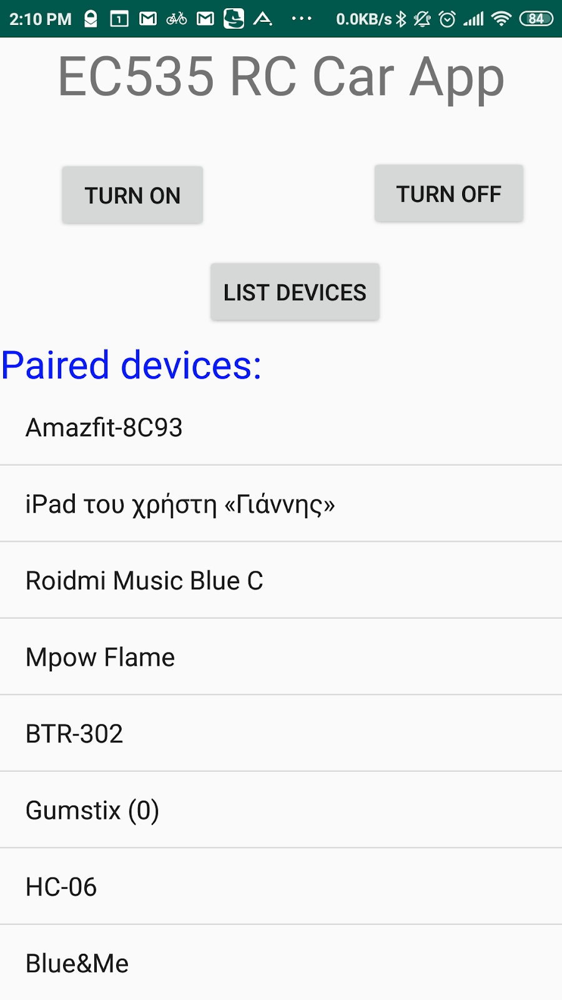

### EC535 Bluetooth Remote Controlled Car

To access Gumstix terminal, we use USB to serial adapter which connects to Gumstix console and LCD module. For serial terminal software we use minicom:
minicom -D /dev/ttyUSB0
And make sure to disable the UART flow control and set the parameters to 8n1 (8bit word, 1stop bit, no parity) and 115200 boud.

Currently, to use the remote control vehicle we must do the following in the Gumstix:

*mknod /dev/mycar c 61 0
*mknod /dev/mycar_auto c 62 0
*insmod mycar.ko
*insmod mycar_auto.ko

At this point the connect the Android application to the bluetooth kernel module. Do this by selecting the 'Gumstix' entry in the list of scanned nearby Bluetooth devices (Figure below).

Finally, run the user level helper progrgram on the Gumstix.
./get_data

This setup process is unfortunately manual, and can be automated as part of an init script.

